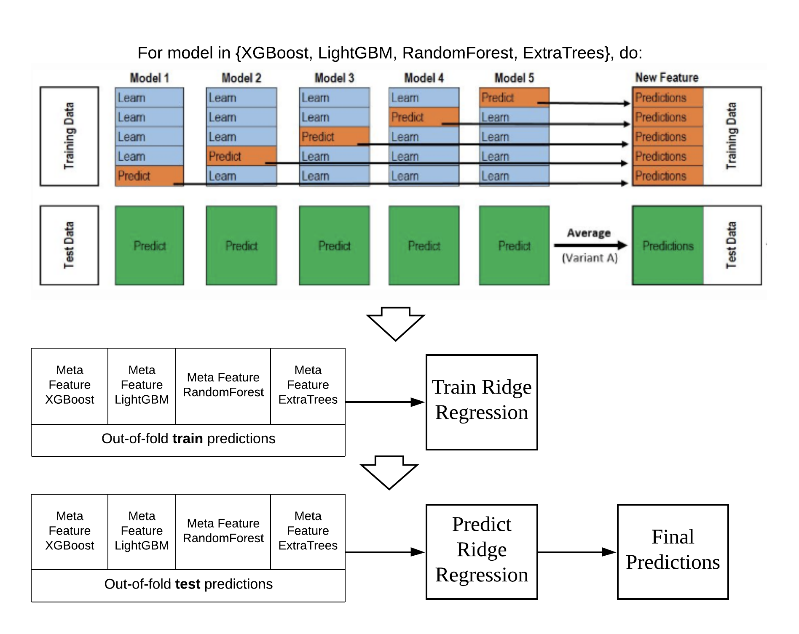

# AI For SEA: Ride Safety Track
My solution for Grab's AI for SEA challenge: Ride Safety Track

## Requirements
1. Python 3 (version >= 3.6 recommended)
2. `pip`
3. `virtualenv`

## Setup
1. Install Python 3 on your system
2. Install `pip`
3. Install `virtualenv`: `pip install virtualenv`
4. Generate virtual environment directory: `virtualenv env`
5. Activate virtual environment:
    * Mac / Linux: `source env/bin/activate`
    * Windows: `env\Scripts\activate.bat`
6. Install dependencies: `pip install -r requirements.txt`

## Predicting Hold-out test set
1. Place the folder containing the test CSV files inside the root project directory. 
   Please make sure the folder is STERILE and contains the hold-out test CSV files only.
2. `python predict_test.py --source [PATH_TO_TEST_FOLDER] --destination [PATH_TO_PREDICTION_CSV_FILE, e.g.: predictions.csv]`

## Project Presentation
### Feature Engineering

### Modelling
For modelling, model stacking approach is utilized. A High level diagram explaining the approach:

 <!-- .element height="100px" width="150px" -->
For the first layer, models such as: RandomForest, ExtraTrees, LightGBM and XGBoost are used to generate meta-features for the second layer training.
Finally, Ridge Regression is used to train the meta-features and generate the final predictions.

credits: part of the diagram was taken from <a href="https://www.kaggle.com/getting-started/18153#post103381">here</a>
